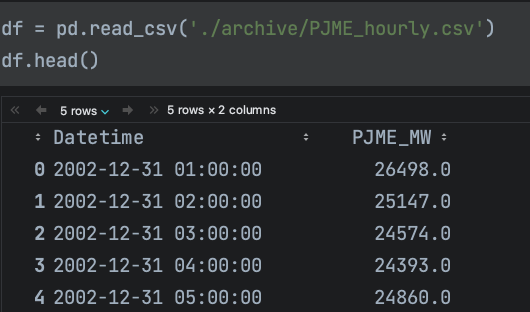
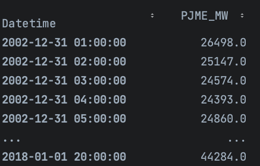
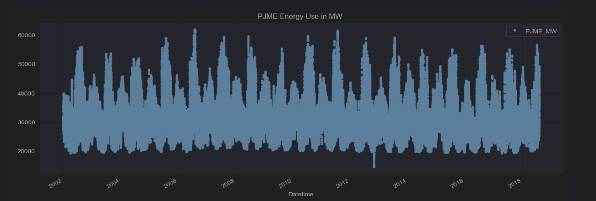
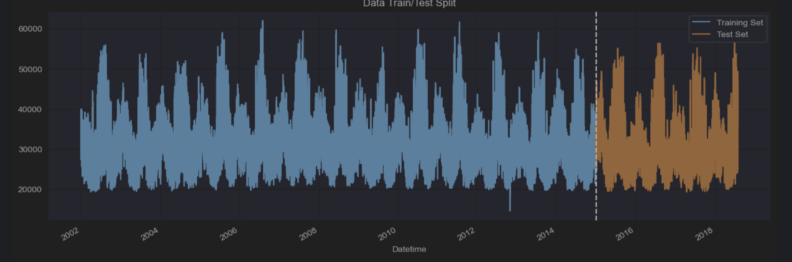
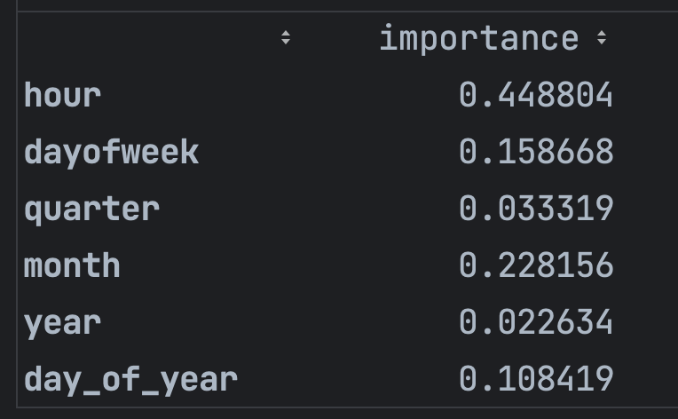
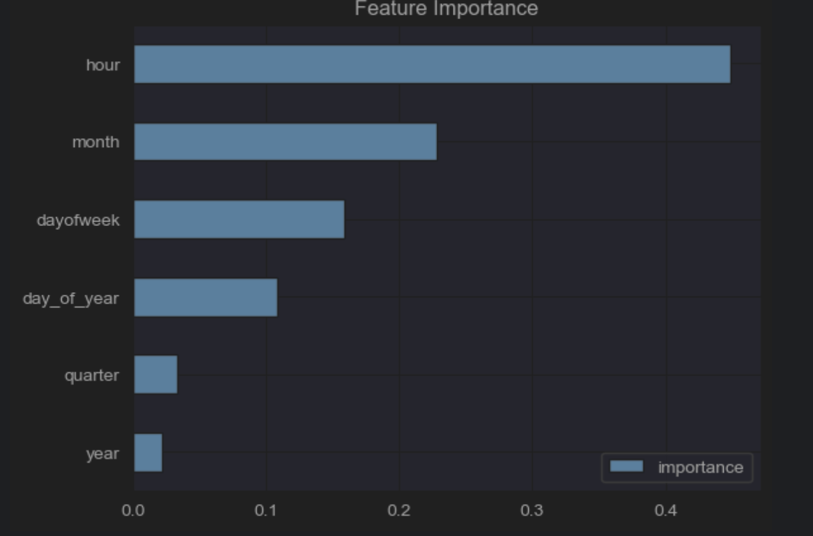

# HourlyEnergyConsumption-Forcast-XGBoost

This is a project to make the XGBoost model to predict the time series data<br/>

* The data source: [Hourly Energy Consumption](https://www.kaggle.com/datasets/robikscube/hourly-energy-consumption)

<br/>

The original dataframe look like this: <br/>
<br/>

I reset index to the time series:
```py
# Set time series as index
df = df.set_index('Datetime')
df.index = pd.to_datetime(df.index) # cast index from object to index
df
```
 <br/>

Plot the df
```py
import seaborn as sns
color_pal = sns.color_palette()
df.plot(style='.',
        figsize=(15, 5),
        color=color_pal[0],
        title='PJME Energy Use in MW ')
```


Train Test Split
```py
#train test split
train = df.loc[df.index < '01-01-2015']
test = df.loc[df.index >= '01-01-2015']

fig, ax = plt.subplots(figsize=(15, 5))
train.plot(ax=ax, label='Training Set', title='Data Train/Test Split')
test.plot(ax=ax, label='Test Set')
ax.axvline('01-01-2015', color='black', ls='--')
ax.legend(['Training Set', 'Test Set'])
plt.show()
```


Decompose time into more features
```py
# Feature Creation
def create_features(df):
        """
        Create time series features based on time series index.
        """
        df = df.copy()
        df['hour'] = df.index.hour
        df['dayofweek'] = df.index.dayofweek
        df['quarter'] = df.index.quarter
        df['month'] = df.index.month
        df['year'] = df.index.year
        df['day_of_year'] = df.index.dayofyear
        return df
        
df = create_features(df)


# split train and test 
# split target and features
train = create_features(train)
test = create_features(test)

FEATURES = ['hour', 'dayofweek', 'quarter', 'month', 'year',
       'day_of_year']
TARGET = 'PJME_MW'

X_train = train[FEATURES]
y_train = train[TARGET]

X_test = test[FEATURES]
y_test = test[TARGET]
```

### Create xgboost model to train and evaluate the data
```py
reg = xgb.XGBRegressor(n_estimators=1000,
                       early_stopping_rounds=50,
                       learning_rate=0.01)
reg.fit(X_train, y_train, eval_set=[(X_train, y_train), (X_test, y_test)],
        verbose=100)
```

# Extract feature importance from xgb
```py
fi = pd.DataFrame(data=reg.feature_importances_,
                  index=reg.feature_names_in_,
                  columns=['importance'])
fi
```

```py
fi.sort_values('importance').plot(kind='barh', title='Feature Importance')
```

